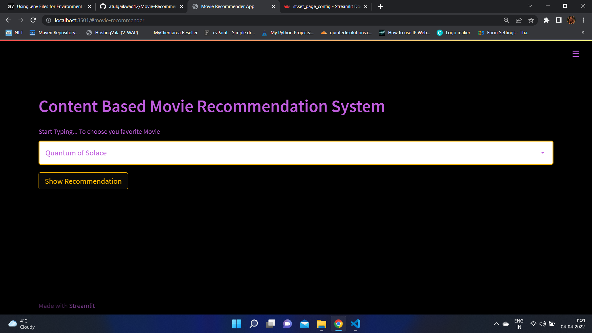
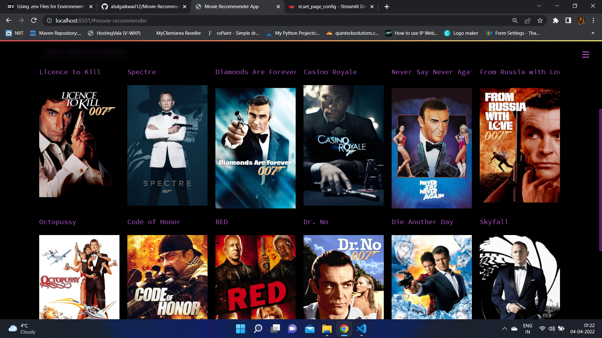

# Project: Movie Recommender System Using Machine Learning!


Recommendation systems are becoming increasingly important in today’s extremely busy world. People are always short on time with the myriad tasks they need to accomplish in the limited 24 hours. Therefore, the recommendation systems are important as they help them make the right choices, without having to expend their cognitive resources.

The purpose of a recommendation system basically is to search for content that would be interesting to an individual. Moreover, it involves a number of factors to create personalised lists of useful and interesting content specific to each user/individual. Recommendation systems are Artificial Intelligence based algorithms that skim through all possible options and create a customized list of items that are interesting and relevant to an individual. These results are based on their profile, search/browsing history, what other people with similar traits/demographics are watching, and how likely are you to watch those movies. This is achieved through predictive modeling and heuristics with the data available.

#### Types of Recoomendation system
1. Content based
2. Collabrative Filtering Based
3. Hybrid based

#### Content Based - 
Recommend based on similiarty of content. Example Iron Man and Iron Man 2 are similia.
#### Collabrative Filtering Based - 
lets say customer 1 and customer 2 have similar kind of interest becuase for most of the movies they 
have given simmilar ratings. 
So for any movie/ movie criteria on which customer 1 has given good rating then its high chance that customer 2 also will give good rating for the same movie.
#### Hybrid Based - 
Both content and collabrative filtering used in hybrid based recommendation 
 


# About this project:

This is a streamlit web application that can recommend various kinds of similar movies based on an user interest.
here is a demo,

* [Click here to run it live on server](https://movie-recommeder-system.herokuapp.com/)


# Demo:







# Dataset has been used:

* [Dataset link](https://www.kaggle.com/tmdb/tmdb-movie-metadata?select=tmdb_5000_movies.csv)


# How to run?
### STEPS:

#### Clone the repository in local directory

```bash
git clone https://github.com/atulgaikwad12/Movie-Recommender-System-ML-ContentBased.git
```
### STEP 01- Create a conda environment after opening the repository

```bash
conda create -n envmovie python=3.7.10 -y
```

```bash
conda activate envmovie
```

### STEP 02- install the requirements
```bash
pip install -r requirements.txt
```


#### Open jupyter notebook run with current env
```bash
jupyter-notebook
```

#### Can Download data set from below location and unzip in data folder 
https://www.kaggle.com/datasets/tmdb/tmdb-movie-metadata/download


```bash
#run this file to generate the models

Movie Recommender System Data Analysis.ipynb
```

Now run,
```bash
streamlit run app.py
```

#### Create repository on github and execute below commands to push code 
```bash
git init
git add .
git commit -m "first commit"
git branch -M main
git remote add origin your_new_github_repo_url
git push -u origin main
```


